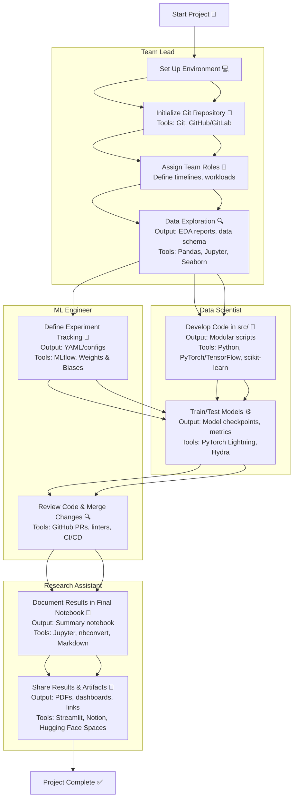

# RMIT MACHINE LEARNING ENVIRONMENT TEMPLATE (RMLET)
This template provides a flexible environment for machine learning and deep learning projects, tailored for RMIT coursework. It aims to streamline setup, encourage good practices, and support collaboration.

**Contents:**
1. [Quick Setup Guide](#quick-guide)
2. [Project Overview](#the-rant-about-the-project)

## QUICK-GUIDE

### Recommended: Anaconda/Miniconda Setup

Use Anaconda/Miniconda for consistent and easy environment management. Install Miniconda:

**Linux/MacOS:**
```sh
wget https://repo.anaconda.com/miniconda/Miniconda3-latest-Linux-x86_64.sh -O miniconda.sh
bash miniconda.sh -b -p $HOME/miniconda3
rm miniconda.sh
```

**Windows:**
```sh
curl https://repo.anaconda.com/miniconda/Miniconda3-latest-Windows-x86_64.exe -o miniconda.exe
Start-Process .\miniconda.exe -ArgumentList "/S" -Wait
del miniconda.exe
```

> **Tip:** For Windows, WSL2 is recommended for better compatibility and GPU support. [Learn more](https://docs.microsoft.com/en-us/windows/wsl/install).

**Set up the environment:**
```sh
conda init
conda env create -f environment.yml
conda activate myenv
```
Install additional packages as needed. When finished, deactivate with `conda deactivate`.

## PROJECT OVERVIEW

### Goals
- Provide a ready-to-use ML/AI project structure.
- Encourage clear, maintainable, and collaborative workflows.
- Support easy experiment tracking and reproducibility.

### Included Packages
- pandas (or polars)
- scikit-learn
- numpy
- matplotlib
- seaborn
- JupyterLab

All packages are managed via `environment.yml`. Add more as needed.

**Recommended tools for advanced projects:**
- [DagsHub](https://dagshub.com/) / [Weights & Biases](https://wandb.ai/site) for experiment tracking.
- [DVC](https://dvc.org/) for data/model versioning.
- [LaTeX](https://www.latex-project.org/) (or [Overleaf](https://www.overleaf.com/)) for reports.

### ML/DL Frameworks
- [TensorFlow](https://www.tensorflow.org/)
- [PyTorch](https://pytorch.org/)
- [Keras](https://keras.io/)

Add these to `environment.yml` as needed.

### Folder Structure

```
data/             # Data storage (see subfolders below)
├── raw/          # Original, immutable data (save for sharing)
├── interim/      # Intermediate data (generated by scripts, not shared)
├── processed/    # Cleaned/feature-engineered data (generated by scripts, not shared)
├── final/        # Final datasets ready for modeling (save for sharing)
model/            # Model-related files
├── weights/      # Saved model weights/checkpoints
├── configs/      # Model configuration files
├── logs/         # Training logs and metrics
src/          # Source code
notebooks/    # Jupyter notebooks
report/       # LaTeX reports, references
environment.yml
```

**Note:** To save cloud space, only `data/raw/` and `data/final/` should be shared as it is. All other data (interim, processed) should be generated from scripts in `src/` or via a DVC pipeline. This way when you track your script on GIT it can be recreated by calling the specific script and rerun the pipeline. If you have multiple dataset separate them by adding the dataset name as subfolder for `src\$dataset_name` and `data\$dataset_name\*` as the following example:

```
data/
├── mnist/
│   ├── raw/
│   ├── interim/
│   ├── processed/
│   └── final/
├── cifar10/
│   ├── raw/
│   ├── interim/
│   ├── processed/
│   └── final/
src/
├── mnist/
│   └── ... # Scripts for MNIST processing/modeling
├── cifar10/
│   └── ... # Scripts for CIFAR-10 processing/modeling
```

This keeps code and data for each dataset separate, making your workflow cleaner and more reproducible.

### Suggested Workflow

#### Example Workflow



**How this works:**
- The project starts with environment setup and Git initialization.
- Team members are assigned roles (e.g., data wrangler, model developer, experiment tracker).
- Use notebooks for EDA and visualization; keep main code in `src/`.
- All code and notebooks are versioned with Git. Use Git tags to mark important experiment milestones.
- Track experiments and artifacts (metrics, models) using MLflow or similar tools.
- Team members review and merge changes via pull requests.
- Final results are documented in a single notebook; exploratory work stays in separate notebooks to avoid conflicts.
- Share results and artifacts with the team using Git, MLflow, or cloud storage.

**Example with 3-5 Group Members:**
- Assign roles such as:
  - Data Engineer: Prepares and documents datasets.
  - Model Developer: Implements and tunes models in `src/`.
  - Experiment Tracker: Sets up and manages MLflow for experiment tracking.
  - Reviewer: Reviews code and notebooks before merging.
- Each member works on their branch, pushing changes to Git.
- Use Git tags to label experiment versions (e.g., `v1.0-baseline`, `v2.0-tuned`).
- MLflow is used to log experiment parameters, results, and artifacts, making it easy to compare runs and reproduce results.
- Regularly merge changes and update the final results notebook.

This workflow ensures clear collaboration, reproducibility, and easy tracking of experiments and results.

**Tip:** Test the environment early with sample data/code to ensure all team members can run the project.

