# RMIT MACHINE LEARNING ENVIRONMENT TEMPLATE (RMLET)
This template provides a flexible environment for machine learning and deep learning projects, tailored for RMIT coursework. It aims to streamline setup, encourage good practices, and support collaboration.

**Contents:**
1. [Quick Setup Guide](#quick-guide)
2. [Template Overview](#template-overview)
3. [Tips](#tips)

## QUICK-GUIDE

### Recommended: Anaconda/Miniconda Setup

Use Anaconda/Miniconda for consistent and easy environment management. Install Miniconda:

**Linux/MacOS:**
```sh
wget https://repo.anaconda.com/miniconda/Miniconda3-latest-Linux-x86_64.sh -O miniconda.sh
bash miniconda.sh -b -p $HOME/miniconda3
rm miniconda.sh
```

**Windows:**
```sh
curl https://repo.anaconda.com/miniconda/Miniconda3-latest-Windows-x86_64.exe -o miniconda.exe
Start-Process .\miniconda.exe -ArgumentList "/S" -Wait
del miniconda.exe
```

> **Tip:** For Windows, WSL2 is recommended for better compatibility and GPU support. [Learn more](https://docs.microsoft.com/en-us/windows/wsl/install).

**Set up the environment:**
```sh
conda init
conda env create -f environment.yml
conda activate myenv
```
Install additional packages as needed. When finished, deactivate with `conda deactivate`. You can change the name of the environment by modify the name of the environment inside the envrionment.yml instead the default one.

## TEMPLATE OVERVIEW

### Goals
- Provide a ready-to-use ML/AI project structure.
- Encourage clear, maintainable, and collaborative workflows.
- Support easy experiment tracking and reproducibility.

### Included Packages
- pandas (or polars)
- scikit-learn
- numpy
- matplotlib
- seaborn
- JupyterLab

All packages are managed via `environment.yml`. Add more as needed.

**Recommended tools for advanced projects:**
- [MLFlow](https://mlflow.org/docs/latest/) (or [DagsHub](https://dagshub.com/) which host a MLflow server even on freetier) / [Weights & Biases](https://wandb.ai/site) for experiment tracking.
- [DVC](https://dvc.org/) for data/model versioning.
- [LaTeX](https://www.latex-project.org/) (or [Overleaf](https://www.overleaf.com/)) for reports.

### ML/DL Frameworks
- [TensorFlow](https://www.tensorflow.org/)
- [PyTorch](https://pytorch.org/)
- [Keras](https://keras.io/)

Add these to `environment.yml` as needed.

### Folder Structure

```
data/             # Data storage (see subfolders below)
├── raw/          # Original, immutable data (save for sharing)
├── interim/      # Intermediate data (generated by scripts, not shared)
├── processed/    # Cleaned/feature-engineered data (generated by scripts, not shared)
├── final/        # Final datasets ready for modeling (save for sharing)
model/            # Model-related files
├── weights/      # Saved model weights/checkpoints
├── configs/      # Model configuration files
├── logs/         # Training logs and metrics
src/          # Source code
notebooks/    # Jupyter notebooks
report/       # LaTeX reports, references
environment.yml
```

**Note:** To save cloud space, only `data/raw/` and `data/final/` should be shared as it is. All other data (interim, processed) should be generated from scripts in `src/` or via a DVC pipeline. This way when you track your script on GIT it can be recreated by calling the specific script and rerun the pipeline. If you have multiple dataset separate them by adding the dataset name as subfolder for `src\$dataset_name` and `data\$dataset_name\*` as the following example:

```
data/
├── mnist/
│   ├── raw/
│   ├── interim/
│   ├── processed/
│   └── final/
├── cifar10/
│   ├── raw/
│   ├── interim/
│   ├── processed/
│   └── final/
src/
├── mnist/
│   └── ... # Scripts for MNIST processing/modeling
├── cifar10/
│   └── ... # Scripts for CIFAR-10 processing/modeling
```

This keeps code and data for each dataset separate, making your workflow cleaner and more reproducible.

### Suggested Workflow

#### Example Workflow

```mermaid
flowchart TD
    A[Start Project 📁] --> B[Set Up Environment 💻]
    B --> C[Initialize Git Repository 🌱<br>Tools: Git, GitHub/GitLab]
    C --> D[Assign Team Roles 👥<br>Define timelines, workloads]
    D --> E[Data Exploration 🔍<br>Output: EDA reports, data schema<br>Tools: Pandas, Jupyter, Seaborn]
    
    E --> F[Develop Code in src/ 📂<br>Output: Modular scripts<br>Tools: Python, PyTorch/TensorFlow, scikit-learn]
    E --> G[Define Experiment Tracking 🧪<br>Output: YAML/configs<br>Tools: MLflow, Weights & Biases]
    
    F --> H[Train/Test Models ⚙️<br>Output: Model checkpoints, metrics<br>Tools: PyTorch Lightning, Hydra]
    G --> H
    
    H --> I[Review Code & Merge Changes 🔍<br>Tools: GitHub PRs, linters, CI/CD]
    I --> J[Document Results in Final Notebook 📒<br>Output: Summary notebook<br>Tools: Jupyter, nbconvert, Markdown]

    J --> K[Share Results & Artifacts 🚀<br>Output: PDFs, dashboards, links<br>Tools: Streamlit, Notion, Hugging Face Spaces]

    K --> L[Project Complete ✅]

    %% Parallel team timelines
    subgraph T1 [Team Lead]
        B --> C --> D --> E
    end

    subgraph T2 [Data Scientist]
        E --> F
        F --> H
    end

    subgraph T3 [ML Engineer]
        G --> H
        H --> I
    end

    subgraph T4 [Research Assistant]
        I --> J --> K
    end

```



**How this works:**

1. **Set Up Environment & Git Repository**
    - All members install dependencies and initialize the Git repo.
    - **Output:** `environment.yml`, `.gitignore`, initial commit (YAML, text files)
    - **Timeline:** Week 1

2. **Assign Team Roles & Define Timelines**
    - Roles are assigned (see below), and project milestones are set.
    - **Output:** `README.md` update, project plan (Markdown)
    - **Timeline:** Week 1

3. **Data Exploration & EDA**
    - Data Engineer leads EDA in notebooks; team discusses findings.
    - **Output:** EDA notebook(s) (Jupyter Notebook, `.ipynb`), data schema (Markdown/CSV)
    - **Timeline:** Weeks 1–2

4. **Develop Modular Code in `src/`**
    - Model Developer implements scripts for preprocessing, modeling, etc.
    - **Output:** Python scripts in `src/` (Python, `.py`)
    - **Timeline:** Weeks 2–3

5. **Set Up Experiment Tracking**
    - Experiment Tracker configures MLflow or similar tools.
    - **Output:** MLflow configs, experiment logs (YAML, JSON, MLflow UI)
    - **Timeline:** Weeks 2–3

6. **Train & Test Models**
    - Model Developer and Data Engineer run experiments, log results.
    - **Output:** Model checkpoints (`.pt`, `.h5`), metrics (CSV/JSON), logs
    - **Timeline:** Weeks 3–4

7. **Review & Merge Changes**
    - Reviewer checks code, notebooks, and experiment logs via pull requests.
    - **Output:** PR comments, merged branches (Markdown, Git)
    - **Timeline:** Ongoing (Weeks 3–4)

8. **Document Final Results**
    - Team compiles a summary notebook and prepares the report.
    - **Output:** Final notebook (`.ipynb`), report (`.tex`/PDF), figures (PNG/SVG/PDF)
   > If you are using the figure for your latex document it better to use PDF as latex can use PDF to render higher quality figure for your report.
    - **Timeline:** Weeks 4–5

9. **Share Results & Artifacts**
    - Results are shared via Git, MLflow, or cloud storage.
    - **Output:** Shared links, exported artifacts (Markdown, links, files)
    - **Timeline:** Week 5

**Example Roles & Outputs:**
- **Data Engineer:** EDA notebooks (`.ipynb`), data schema (`.md`/`.csv`)
- **Model Developer:** Python scripts (`src/`), model weights (`model/weights/`)
- **Experiment Tracker:** MLflow setup/configs (`mlruns/`, YAML/JSON), experiment logs
- **Reviewer:** PR reviews/comments (Markdown, GitHub UI)
- **Report Writer:** Final notebook (`notebooks/`), LaTeX report (`report/`)

**Rough Timeline:**  
- **Week 1:** Setup, team roles, initial EDA  
- **Weeks 2–3:** EDA, code development, experiment tracking  
- **Weeks 3–4:** Modeling, training, review  
- **Weeks 4–5:** Documentation, reporting, sharing results

Adjust the timeline as needed for longer or more complex projects. This workflow ensures clear collaboration, reproducibility, and easy tracking of experiments and results.

## TIPS

**Tip 1:** Test the environment early with sample data/code to ensure all team members can run the project. This make a different when dealing with massive dataset or audio, visual datasets. A small sample of 100 is plenty for most tasks.

**Tip 2:** It a good idea to create a [Makefile](https://makefiletutorial.com/) that combine all script into a single command in CLI for simpler and consistent process when working with more complex project or multiple tools.

> NOTE: Makefile help to reduce the chance for someone to mistakenly run a old pipeline or wrong config of mini services on their system. Instead of typing something like `mlflow server --backend-store-uri sqlite:///mlflow.db --default-artifact-root ./artifacts --host 0.0.0.0 --app-name basic-auth`, you can just type `make mlflow-auth-start`.

**Tip 3:** For long running session a push notification tool is extremly helpful to allow for your to check on your code running status without having to physically be on your notebook or script. [Ntfy](https://docs.ntfy.sh/), have a self-host version, or [Pushover](https://pushover.net/), os license one-time payment, are two option I highly recommend.

**Tip 4:** You can turn your desktop into a Colab like server using [Tailscale](https://tailscale.com/) plus a remote desktop program like [Rustdesk](https://rustdesk.com/). Tailscale streamline you VPN setting allow you to easily securly serve our MLFlow, or Jupyter Lab without exposing our network in a unsecure manner. Rustdesk help you run these service remotely without worry about SSH session timeout. 

> WARNING: Home server also mean you will be responsible for your own up time. Thus, alway run your script defensively (constant saving, checkpoints etc) like when you running on Colab. You can reduce the down time by adding UPS for your network and computing devices but this will add a upfront cost. Cheap alternative is using a laptop since it have it own battery pack and GPU but this mean exchanging for lower computing power (Laptop GPU is weaker than it desktop version). Proceed with these issues in mind.

**Tip 5:** Use Tailscale serve (Funnel) option to open up your MLflow server for remote tracking. You should away secure MLflow server using basic authentication, beta support as current speaking, or custom authentication prior exposing your service to the internet. But in exchange you can now switch between different machine or VM instance with more powerful GPU while still having the run output store directly on your local system. 

> WARNING: Do ensure you have data backup solution on your machine as you don't have the benefit of cloud or enterprise level backup on local machine for your experiment results. Cheap way to overcome this is using some form or cloud sync on your device like OneDrive or Icloud to backup you computer to the cloud. Alternatively you can set up RAID on your system if you have multiple SSD or HDD.
