# RMIT MACHINE LEARNING ENVIRONMENT TEMPLATE (RMLET)
This template provides a flexible environment for machine learning and deep learning projects, tailored for RMIT coursework. It aims to streamline setup, encourage good practices, and support collaboration.

**Contents:**
1. [Quick Setup Guide](#quick-guide)
2. [Project Overview](#the-rant-about-the-project)

## QUICK-GUIDE

### Recommended: Anaconda/Miniconda Setup

Use Anaconda/Miniconda for consistent and easy environment management. Install Miniconda:

**Linux/MacOS:**
```sh
wget https://repo.anaconda.com/miniconda/Miniconda3-latest-Linux-x86_64.sh -O miniconda.sh
bash miniconda.sh -b -p $HOME/miniconda3
rm miniconda.sh
```

**Windows:**
```sh
curl https://repo.anaconda.com/miniconda/Miniconda3-latest-Windows-x86_64.exe -o miniconda.exe
Start-Process .\miniconda.exe -ArgumentList "/S" -Wait
del miniconda.exe
```

> **Tip:** For Windows, WSL2 is recommended for better compatibility and GPU support. [Learn more](https://docs.microsoft.com/en-us/windows/wsl/install).

**Set up the environment:**
```sh
conda init
conda env create -f environment.yml
conda activate myenv
```
Install additional packages as needed. When finished, deactivate with `conda deactivate`.

## PROJECT OVERVIEW

### Goals
- Provide a ready-to-use ML/AI project structure.
- Encourage clear, maintainable, and collaborative workflows.
- Support easy experiment tracking and reproducibility.

### Included Packages
- pandas (or polars)
- scikit-learn
- numpy
- matplotlib
- seaborn
- JupyterLab

All packages are managed via `environment.yml`. Add more as needed.

**Recommended tools for advanced projects:**
- [DagsHub](https://dagshub.com/) / [Weights & Biases](https://wandb.ai/site) for experiment tracking.
- [DVC](https://dvc.org/) for data/model versioning.
- [LaTeX](https://www.latex-project.org/) (or [Overleaf](https://www.overleaf.com/)) for reports.

### ML/DL Frameworks
- [TensorFlow](https://www.tensorflow.org/)
- [PyTorch](https://pytorch.org/)
- [Keras](https://keras.io/)

Add these to `environment.yml` as needed.

### Folder Structure

```
data/             # Data storage (see subfolders below)
├── raw/          # Original, immutable data (save for sharing)
├── interim/      # Intermediate data (generated by scripts, not shared)
├── processed/    # Cleaned/feature-engineered data (generated by scripts, not shared)
├── final/        # Final datasets ready for modeling (save for sharing)
model/            # Model-related files
├── weights/      # Saved model weights/checkpoints
├── configs/      # Model configuration files
├── logs/         # Training logs and metrics
src/          # Source code
notebooks/    # Jupyter notebooks
report/       # LaTeX reports, references
environment.yml
```

**Note:** To save cloud space, only `data/raw/` and `data/final/` should be shared as it is. All other data (interim, processed) should be generated from scripts in `src/` or via a DVC pipeline. This way when you track your script on GIT it can be recreated by calling the specific script and rerun the pipeline. If you have multiple dataset separate them by adding the dataset name as subfolder for `src\$dataset_name` and `data\$dataset_name\*` as the following example:

```
data/
├── mnist/
│   ├── raw/
│   ├── interim/
│   ├── processed/
│   └── final/
├── cifar10/
│   ├── raw/
│   ├── interim/
│   ├── processed/
│   └── final/
src/
├── mnist/
│   └── ... # Scripts for MNIST processing/modeling
├── cifar10/
│   └── ... # Scripts for CIFAR-10 processing/modeling
```

This keeps code and data for each dataset separate, making your workflow cleaner and more reproducible.

### Suggested Workflow

#### Example Workflow

```mermaid
flowchart TD
    A[Start Project 📁] --> B[Set Up Environment 💻]
    B --> C[Initialize Git Repository 🌱<br>Tools: Git, GitHub/GitLab]
    C --> D[Assign Team Roles 👥<br>Define timelines, workloads]
    D --> E[Data Exploration 🔍<br>Output: EDA reports, data schema<br>Tools: Pandas, Jupyter, Seaborn]
    
    E --> F[Develop Code in src/ 📂<br>Output: Modular scripts<br>Tools: Python, PyTorch/TensorFlow, scikit-learn]
    E --> G[Define Experiment Tracking 🧪<br>Output: YAML/configs<br>Tools: MLflow, Weights & Biases]
    
    F --> H[Train/Test Models ⚙️<br>Output: Model checkpoints, metrics<br>Tools: PyTorch Lightning, Hydra]
    G --> H
    
    H --> I[Review Code & Merge Changes 🔍<br>Tools: GitHub PRs, linters, CI/CD]
    I --> J[Document Results in Final Notebook 📒<br>Output: Summary notebook<br>Tools: Jupyter, nbconvert, Markdown]

    J --> K[Share Results & Artifacts 🚀<br>Output: PDFs, dashboards, links<br>Tools: Streamlit, Notion, Hugging Face Spaces]

    K --> L[Project Complete ✅]

    %% Parallel team timelines
    subgraph T1 [Team Lead]
        B --> C --> D --> E
    end

    subgraph T2 [Data Scientist]
        E --> F
        F --> H
    end

    subgraph T3 [ML Engineer]
        G --> H
        H --> I
    end

    subgraph T4 [Research Assistant]
        I --> J --> K
    end

```



**How this works:**

1. **Set Up Environment & Git Repository**
    - All members install dependencies and initialize the Git repo.
    - **Output:** `environment.yml`, `.gitignore`, initial commit (YAML, text files)
    - **Timeline:** Week 1

2. **Assign Team Roles & Define Timelines**
    - Roles are assigned (see below), and project milestones are set.
    - **Output:** `README.md` update, project plan (Markdown)
    - **Timeline:** Week 1

3. **Data Exploration & EDA**
    - Data Engineer leads EDA in notebooks; team discusses findings.
    - **Output:** EDA notebook(s) (Jupyter Notebook, `.ipynb`), data schema (Markdown/CSV)
    - **Timeline:** Weeks 1–2

4. **Develop Modular Code in `src/`**
    - Model Developer implements scripts for preprocessing, modeling, etc.
    - **Output:** Python scripts in `src/` (Python, `.py`)
    - **Timeline:** Weeks 2–3

5. **Set Up Experiment Tracking**
    - Experiment Tracker configures MLflow or similar tools.
    - **Output:** MLflow configs, experiment logs (YAML, JSON, MLflow UI)
    - **Timeline:** Weeks 2–3

6. **Train & Test Models**
    - Model Developer and Data Engineer run experiments, log results.
    - **Output:** Model checkpoints (`.pt`, `.h5`), metrics (CSV/JSON), logs
    - **Timeline:** Weeks 3–4

7. **Review & Merge Changes**
    - Reviewer checks code, notebooks, and experiment logs via pull requests.
    - **Output:** PR comments, merged branches (Markdown, Git)
    - **Timeline:** Ongoing (Weeks 3–4)

8. **Document Final Results**
    - Team compiles a summary notebook and prepares the report.
    - **Output:** Final notebook (`.ipynb`), report (`.tex`/PDF), figures (PNG/SVG)
    - **Timeline:** Weeks 4–5

9. **Share Results & Artifacts**
    - Results are shared via Git, MLflow, or cloud storage.
    - **Output:** Shared links, exported artifacts (Markdown, links, files)
    - **Timeline:** Week 5

**Example Roles & Outputs:**
- **Data Engineer:** EDA notebooks (`.ipynb`), data schema (`.md`/`.csv`)
- **Model Developer:** Python scripts (`src/`), model weights (`model/weights/`)
- **Experiment Tracker:** MLflow setup/configs (`mlruns/`, YAML/JSON), experiment logs
- **Reviewer:** PR reviews/comments (Markdown, GitHub UI)
- **Report Writer:** Final notebook (`notebooks/`), LaTeX report (`report/`)

**Rough Timeline:**  
- **Week 1:** Setup, team roles, initial EDA  
- **Weeks 2–3:** EDA, code development, experiment tracking  
- **Weeks 3–4:** Modeling, training, review  
- **Weeks 4–5:** Documentation, reporting, sharing results

Adjust the timeline as needed for longer or more complex projects. This workflow ensures clear collaboration, reproducibility, and easy tracking of experiments and results.

**Tip:** Test the environment early with sample data/code to ensure all team members can run the project.

